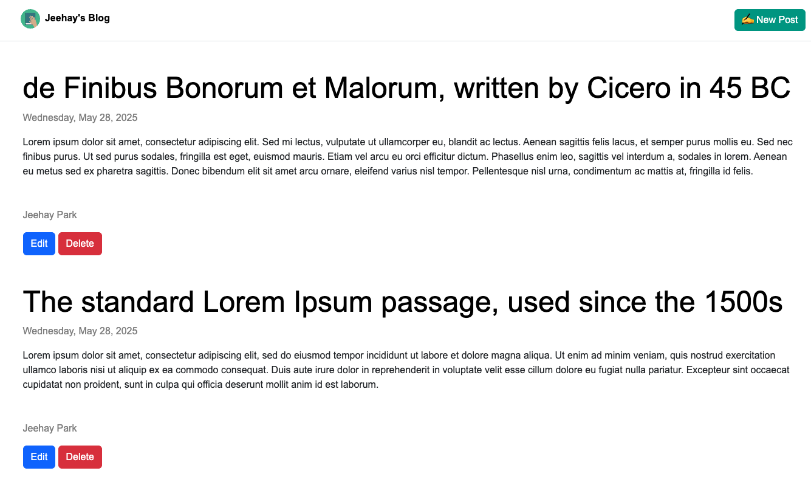
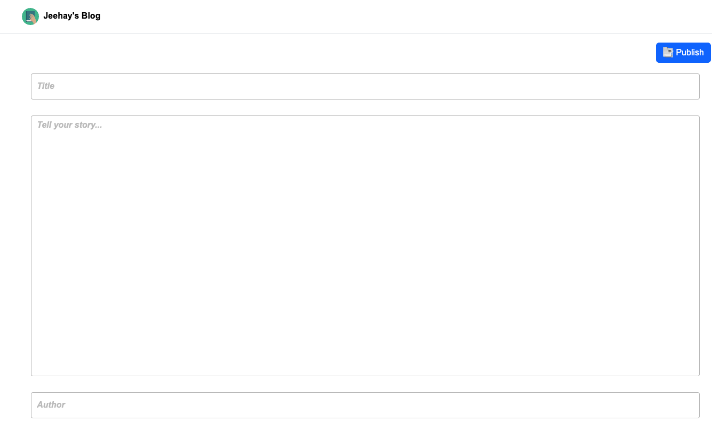

# 📝 블로그
Node.js, Express, EJS, Bootstrap을 사용해 구현한 간단한 블로그

<p>


</p>

<p>

</p>

<br><br><br>

## 🔗 배포 링크
[블로그 바로가기](https://blog-4c1y.onrender.com)
- 💤 서버가 자고 있을 수도 있어요. 잠에서 깨우는 중이니 로딩이 조금 느릴 수 있어요... 잠시만 기다려 주세요!
<br><br><br>

## ✨ 주요 기능
- 서버 사이드 렌더링
- 반응형 웹 디자인
- 간단한 게시글 등록 및 조회
<br><br><br>

## 🚀 기술 스택
Node.js · Express · EJS · Bootstrap · Render
<br><br><br>

## 🛠 로컬에서 실행하기
```bash
npm install  
node index.js
```
브라우저에서 http://localhost:3000 접속